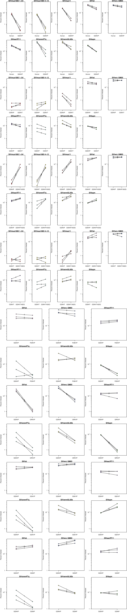

# Analysis code for "CD4 receptor diversity in chimpanzees protects against SIV infection"

To regenerate the analysis, run `make` in this directory. 

The code depends on the R package `rstan` available from CRAN (`install.packages('rstan')`) and was run in R version 3.4.4 with rstan version 2.18.2.

This code should generate analysis result files in the `out` directory. Example output is available in the `exampleOut` directory where:
* file ending in `Raw.pdf`: show the raw infectivity data for three replicate experiments
* file ending in `Fits.pdf`: give graphical summaries of the posterior probabilities for the change in infectivity between two alleles from the Bayesian analysis
* file ending in `Stats.pdf`: record summaries of the posterior probabilities for the change in infectivity between two alleles from the Bayesian analysis
* `glm.pdf`: shows the results of a logistic regression of SIV infection on the presence of polymorphisms in wild chimps

## SIVcpz envs
### Raw data

### Bayesian estimates

## SIV envs
### Raw data

### Bayesian estimates

## MB897 mutants
### Raw data

### Bayesian estimates

## SIV infection in wild chimps

